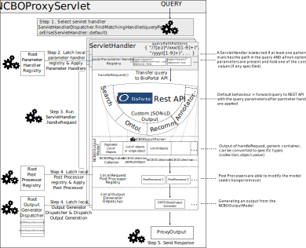

# ncboproxy

General REST proxy architecture for the seamless extension of APIs based on the NCBO BioPortal technology. The original NCBO API described at http://data.bioontology.org/documentation and corresponding project is https://github.com/ncbo). The description of the NCBO Virtual Appliance is available here: https://www.bioontology.org/wiki/index.php/Category:NCBO_Virtual_Appliance

This document explains the general software architecture of the proxy and illustrates how extentions can be added (servlet handlers, parameter pre-processors, output post-processors, output generators). 

Currently, the only servlet handler implemented pertains to the export of ontology metadata in the OMTD-Share format, the registration of new components will be illustrated step-by-step for the usecase of the OMTD-Share adapter. 

Another related proxy project was implemented for extending the NCBO Annotator architecture: https://github.com/sifrproject/annotators
Eventually, these two projects will be merged into one unique proxy.

- [ncboproxy](#ncboproxy)
  * [General architecture](#general-architecture)
    + [Servlet handlers](#servlet-handlers)
    + [Parameter handlers](#parameter-handlers)
    + [Post-processors](#post-processors)
    + [OutputGenerators](#outputgenerators)
    + [NCBOOutputModel](#ncbooutputmodel)
    + [NCBOProxyServlet](#ncboproxyservlet)
    + [Graphical summary](#graphical-summary)
  * [OMTDShare Adapter](#omtdshare-adapter)
    + [API Usage](#api-usage)
  * [Deployment](#deployment)
    + [Building the war file and configuring the proxy](#building-the-war-file-and-configuring-the-proxy)

## General architecture

This is a maven project composed of two sub-modules:

- `ncboproxy-api` ([Javadoc](https://agroportal.github.io/ncboproxy/ncboproxy-api/)) - Contains interface specifications and default implementations for the different parts of the architecture: Default registries (parameter registry, post-processor registry, output generator dispatcher, servlet handler dipatcher), JSON-LD model object mapping, default output generators (json, error). 
- `ncboproxy-servlet` ([Javadoc](https://agroportal.github.io/ncboproxy/ncboproxy-servlet/)) - The servlet implementation itself that ties everything together and concrete `ServletHandler` implementations defining extended behaviour. By convention each `ServletHandler` implementations and all related implementations (parameter handlers, post-processors, output generators) are to be added in separate sub-packages.

### Servlet handlers

A `ServletHandler` is the central piece of the proxy architecture. An abstract class (`AbstractServletHandler`) implements the `ServletHandler` interface and all subsequent implementations are required to extend the abstract class rather than reimplementing their own, given that a set of consistent default behaviours are predefined in the abstract class.

A particular servlet handler is triggered based on: 

- match on a query path pattern (regular expression, for example `/ontologies/[A-Z]+/?`);
- on a set of parameters (constraint on parameter names and values, for example `format=omtd-share`).

The list of trigger query path patterns is to be populated in the constructor of the implementation. `ParameterHandler` implementations must also be registered from the constructor with the `this.registerParameterHander(…)` method. 

Each servlet handler contains a parameter handler registry, a post-processor registry and an output generator registry that will hold custom handler and output generators. 

When a servlet handler is triggered in `NCBOProxyServlet`, the contents of its registries are transfered to the root parameter/post-processor/output generator registries instanciated in the servlet handler (for doGET/doPOST) and overrides any handlers or generators with the same identifiers. 

A `Map<String,String> outputParameters` is passed along from parameter handlers, to the `ServletHandler`, to post-processors and to the output generator. Aside from modifications made to the model itself, this is the only way of passing parameters and values along. This ensures maximum decoupling between the components.  

### Parameter handlers

Each parameter handler is meant to handle one or more parameter names with an optionnal constraint to a list of specific values. A parameter handler can be marked as optional or as mandatory. A mandatory parameter handler registered in a servlet handler become a contraint for the servlet handler to be triggered. 

For instance if one registers a parameter handler in a servlet handler for the parameter `format` constrained to the value `omtd-share` and marked as mandatory, the servlet handler will only trigger if the query contains the parameter value pair `&format=omtd-share`.

Parameter handlers can remove/add parameters to the query before it is forwarded, register post-processor and/or output generators based on conditions on specific paramater and value constraints.

### Post-processors

A post-processor can be registered by a parameter handler or directly from a servlet handler. The purpose of the post-processor is to perform actions on the `NCBOOutputModel` parsed from the output of the query to the original REST API, for example to remove elements, add new elements or modify existing elements. 

The default implementation of the output model is based on a JSON object representation and is serializable to JSON-LD seamlessly. 

### OutputGenerators

An output generator takes as input an `NCBOOutputModel` instance and transforms it into a `ProxyOutput` instance that contains the output that will be sent as a response to the query by the servlet (String or byte array content + mime/type + optionally custom headers). 

By default a JSON-LD output generator and an error output generator are provided and registered by default. The former generates a response based on the `.toPrettyString()` serialization of the `NCBOOutputModel`. The error model is a JSON model containing an error message and an error code, following the JSON error format of NCBO BioPortal. 

### NCBOOutputModel

`NCBOOutputModel` is the root interface for the BioPortal JSON-LD object model wrapper as returned by an `NCBOOutputParser`. `NCBOOutputModel` is implemented by several sub-interfaces that correspond to the different possible types of responses returned by the NCBO BioPortal rest API: a JSON-LD object (`JSONLDObject`, a collection of JSON-LD objects (`NCBOCollection`), a paginated collection of JSON-LD objects (`NCBOPaginatedCollection`), a value (`JSONLDValue`). 

Each of the interfaces features a `.create()` method that instanciates the default implementations. Moreover, each object of type `NCBOOutputModel` contains a set of methods to determine the precise type of model contained inside: `isCollection()`, `isObject()`, `isPaginatedCollection()`,` isString()`, `isInteger()`, `isBoolean()` and a set of methods to convert the instance to its actual type (as an `Optional`). 

### NCBOProxyServlet

`NCBOProxyServlet` ties everything together: 

1. Contains an attribute of type `ServletHandlerDispatcher`, where all servlet handlers are registered (in the contructor of `NCBOProxyServlet`)

2. It creates the root registries and registers all default handlers (default servlet handler, parameter handlers and output generators)

3. Implements the workflow:

   - Selects the ServletHandler best matching the current query or falls back to the default handler 
   ```Java
     ServletHandlerDispatcher.findMatchingHandler(queryPath)
     .orElse(ServletHandler::default)
   ```
   - Applies the parameter handlers (`ParameterHandlerRegistry.processParameters`)
   - Calls the main method of the `ServletHandler` selected (`handleRequest`)
   - Applies the registered post-processors on the resulting NCBOOutputModel (`ResponsePostProcessorRegistry.apply`)
   - Dispatches the post-processed model to the appropriate output generator (`OutputGeneratorDispatcher.generate`)


### Graphical summary

The following diagram illustrates the full process graphically:



## OMTDShare Adapter

The OMTD-Share adapter for the ontology metadata is implemented as a custom `ServletHandler`. Support is included to export the metadata of single ontologies or for all the ontologies on a given portal (SIFR BioPortal, AgroPortal, NCBO BioPortal, BiblioPortal).

The single ontology adapter is implemented in `OmTDShareSingleServletHandler` and registers  the `OMTDShareOutputGenerator` to generate OMTDShare XML from the `NCBOOutputModel`. We use JAXB to bind the XSD specification of OMTD-Share to a Java object model so as to be able to generate an object model from our metadata and unmarshall it as valid OMTD-Share XML. This imoplementation is based on the 3.0.2 version of the OMTD-Share implementation. The XSD specification files are included as a resource of the project and the object model is generated on the fly through the JAXB maven plugin on the install target. 

`OMTDShareOutputGenerator` delegates the actual population of the object model from metadata properties to the `OMTDShareModelMapper`, which retrieves the metadata properties from out NCBOOutputModel. The interface provides a method for each of the categories of metadata required by the OpenMinted call. 

`OMTDShareModelMapper` provides a set of static methods to facilitate the retrival of the metadata from the `NCBOOutputModel`:

```java
static String getSubmissionPropertyValue(final NCBOOutputModel model, final String propertyName);

static Integer getSubmissionPropertyIntValue(final NCBOOutputModel model, final String propertyName);

static String getSubmissionPropertyValue(final NCBOOutputModel model, final String... propertyName);

static List<String> getSubmissionPropertyCollection(final NCBOOutputModel model, final String propertyName);

static List<String> getOntologyPropertyCollection(final NCBOOutputModel model, final String propertyName);

static String getOntologyLinkValue(final NCBOOutputModel model, final String propertyName);

static String getOntologyPropertyValue(final NCBOOutputModel model, final String propertyName);

static String getOntologyPropertyValue(final NCBOOutputModel model, final String... propertyName);
```

The only implementation of `OMTDShareModelMapper` is `AgroportalModelMapper`. `AgroportalModelMapper` implements all the metadata mapping for the extended AgroPortal model and fallsback on defaults that correspond to the NCBO BioPortal metadata model. The model mapper is parametrized with the language of the portal depending on the REST API URI.

### API Usage

For each portal (including AgroPortal), a special service will be deployed and will be accessible at thefollowing URL:

**AgroPortal**: http://services.agroportal.lirmm.fr/ontologies?format=omtd-share&apikey=xxx 

**SIFR BioPortal**: http://services.bioportal.lirmm.fr/ontologies?format=omtd-share&apikey=xxx

**NCBO BioPortal:** http://services.agroportal.lirmm.fr/ncbobioportal/ontologies?format=omtd-share&apikey=xxx that will be routed from an address in the biolontology.org name hold by Stanford.

**BiblioPortal:** http://services.agroportal.lirmm.fr/biblioportal/ontologies?format=omtd-share&apikey=xxx that will be routed from an address in the ontoportal.org name hold by Stanford.

As seen in the previous example, adding the following parameters in the API call will return only the XML for a given ontology:

/ACRONYM?format=omtd-share

For instance: http://services.agroportal.lirmm.fr/ontologies/FOODON/?format=omtd-share&apikey=xxx

## Deployment

There are two depoyment options for the NCBO Proxy, the first is to deploy it as the ROOT servlet of the application server (preferred) and the second is to deploy it in a sub-path of the root. In the latter case, the root for the API calls becomes the sub-path. Please not that the proxy has only been tested with Apache Tomcat 8. Deployment on other application servers may require additional configuration steps. 

If one wants to depoy with the first option on `services.myportalinstance.org`, then one needs to copy the ROOT.war file generated (target/ROOT.war in the ncboproxy-servlet module) to the `webapps` directory of the application server. The API will be accessible from the root of the deployment domain http://services.myportalinstance.org/. One needs to make sure to delete the default root static content `rm -rf /pathtoapplicationserver/webapps/ROOT`.

Alternatively, with the second deployent option where one seeks to deploy on , `services.myportalinstance.org/subpath`, then the ROOT.war file should be copied to the root of the `webapps` directory of the application server as `subpath.war`. 

__Requirements:__ 

* A functional BioPortal instance with its REST API accessible to the application server (same server or public IP/demain). The NCBO Proxy has been build atop the NCBO BioPortal v4.0 software and v2.4 of NCBO Virtaul Appliance modified with a new metadata model as explained here: https://github.com/agroportal/documentation/wiki/Ontology-metadata
* Tomcat 8+
* Java JDK 8+
* Apache Maven 3+

### Building the war file and configuring the proxy

1. First, clone the repository and enter the root of the project: 

```shell
git clone https://github.com/agroportal/ncboproxy.git
cd ncboproxy
```

2. Then, rename the sample configuration properties file (proxy.properties.sample) to proxy.properties

```shell
mv ncboproxy-servlet/src/main/resources/proxy.properties.sample ncboproxy-servlet/src/main/resources/proxy.properties 
```

3. Edit the configuration properties file 

```
server.encoding = utf-8 #This is the URI encoding configured in the application server
ontologiesApiURI=http://myrestapi.mybioportalinstance.org #This is the URL of the REST API of your Bioportal instance
#deploymentRoot=ncbobioportal # For the second deployment option, please specify the name of the subpath where you want to deploy

```

4. Build the project and generate the war file:

```shell
mvn clean install 

#Note: the unit tests need access to the internet to run properly against our staging environemnt, if that's not the case on your server, please disable the tests when running maven:
#mvn clean install -Dmaven.test.skip=true
```

`ROOT.war` can now be found in ncboproxy-servlet/target/ROOT.war and is ready to be deployed on the application server.

__If you use the second deployment option, please remember to uncomment the deploymentRoot configuration property and to set it to subpath, where subpath is the subpath where you want to deploy and to rename ROOT.war to subpath.war (as far as Tomcat is concerned).__

__If you are using Tomcat 8, it is preferable that you set the URIEncoding attribute of the connector to "UTF-8" and the server.encoding configuration property of the proxy to utf-8.__
